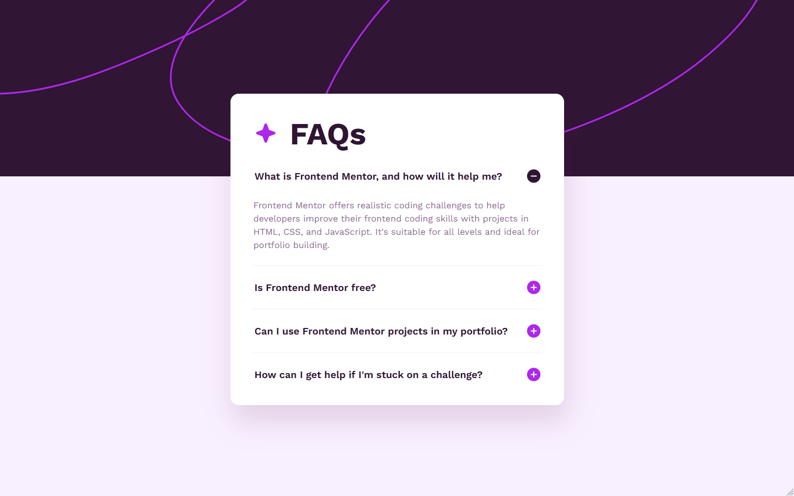

# Frontend Mentor - FAQ accordion solution

This is a solution to the [FAQ accordion challenge on Frontend Mentor](https://www.frontendmentor.io/challenges/faq-accordion-wyfFdeBwBz). Frontend Mentor challenges help you improve your coding skills by building realistic projects. 

## Table of contents

- [Overview](#overview)
  - [The challenge](#the-challenge)
  - [Screenshot](#screenshot)
  - [Links](#links)
- [My process](#my-process)
  - [Built with](#built-with)
  - [What I learned](#what-i-learned)
  - [Continued development](#continued-development)
  - [Useful resources](#useful-resources)
- [Author](#author)

## Overview

### The challenge

Users should be able to:

- Hide/Show the answer to a question when the question is clicked
- Navigate the questions and hide/show answers using keyboard navigation alone
- View the optimal layout for the interface depending on their device's screen size
- See hover and focus states for all interactive elements on the page

### Screenshot

### Links

- Solution URL: [Github](https://github.com/Absynthee/faq-accordion-main)
- Live Site URL: [Github Pages](https://absynthee.github.io/faq-accordion-main/)

## My process

### Built with

- HTML
- CSS
- CSS custom properties
- Javascript

### What I learned

This project helped me to understand custom CSS properties by utilising the ``:after`` modifier. It was also an introduction to Javascript, and while I somewhat grasp *how* it works, I wouldn't be able to write it myself without help. 

I wanted to make the first button be active by default, as shown in the desktop preview image. Doing this and making sure the correct state was applied for the right icon to show took me a while, and Copilot helped me edit the javascript to be able to do this.

### Continued development

10 MONTH UPDATE: Updated the html to include semantics, seperated css and javascript into their own files and added a transition to the height of the accordion so it opens and closes smoothly.

### Useful resources

- [w3schools](https://www.w3schools.com/howto/howto_js_accordion.asp) - How TO - Collapsibles/Accordion.

## Author

- Website - [Austin Spillman](https://www.austinspillman.com)
- Frontend Mentor - [@Absynthee](https://www.frontendmentor.io/profile/Absynthee)
